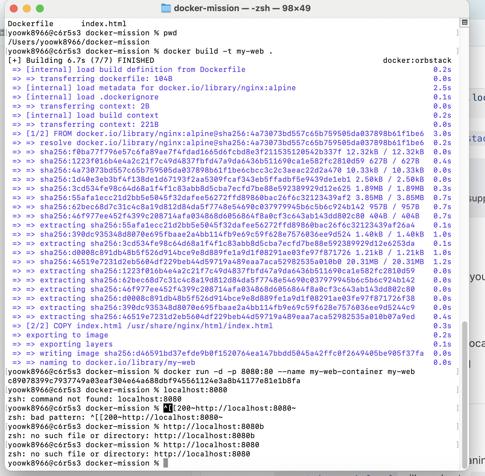
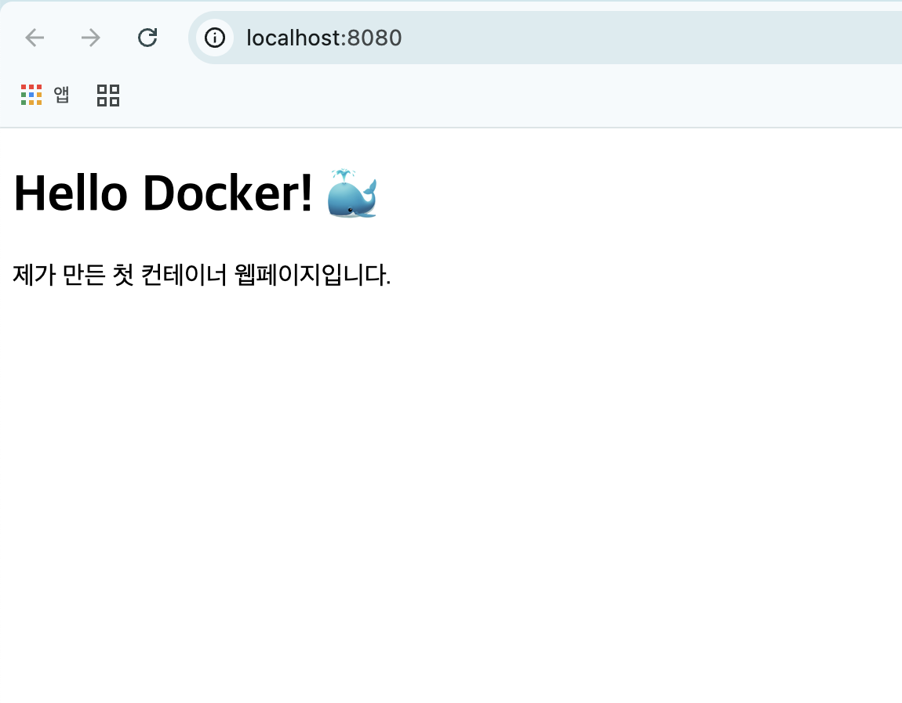

# 미션소개
서울캠퍼스 환경에서는 시스템 보안 정책상 sudo 권한 사용이 제한될 수 있습니다.
이로 인해 일반적인 방식으로 Docker를 직접 설치하거나 데몬을 제어하는 데 제약이 있습니다.
이 문제를 해결하기 위해, 본 과정에서는 OrbStack을 활용합니다.
OrbStack은 Docker Desktop과 유사한 컨테이너 실행 환경을 제공하는 애플리케이션으로,
별도의 sudo 권한 없이도 컨테이너를 실행하고 관리할 수 있도록 지원합니다.

교육생은 다음과 같은 방식으로 OrbStack을 활용하게 됩니다:

OrbStack 애플리케이션을 실행하면 내부적으로 Docker 엔진이 함께 구동됩니다.
이후 터미널에서는 기존과 동일하게 docker 명령어를 사용할 수 있습니다.
예: docker run, docker ps, docker build 등


# Docker를 이용한 간단한 웹 서버 배포 미션

이 프로젝트는 Docker를 사용하여 Nginx 기반의 정적 웹 페이지를 빌드하고 실행하는 미션입니다.

## 사용 기술
- Docker(OrbStack)
- Nginx
- HTML/CSS

## 🚀 실행 방법


### 1. Docker 이미지 빌드

```bash
docker build -t my-web-server .
```



code images/missionimage.png


### 2. Docker 컨테이너 실행

docker run -d -p 8080:80 --name my-web-container my-web-server

🔗 접속 주소
컨테이너가 실행되면 브라우저에서 아래 주소로 접속할 수 있습니다.

http://localhost:8080


code images/docker-webpage.png


📝 학습 내용
Dockerfile 작성법 (FROM, COPY 등)
Docker 이미지 빌드 및 컨테이너 실행
포트 포워딩(8080:80)의 개념 이해
GitHub을 통한 프로젝트 관리


### 3단계: 저장하기
* 내용을 다 붙여넣었다면 **`Command(⌘)` + `S`**를 눌러 저장.


### 4단계: GitHub에 올리기 (마지막 단계!)
이제 만든 파일을 GitHub 저장소에 반영해야 합니다. VS Code 아래쪽의 **Terminal(터미널)**에 다음 명령어를 순서대로 입력하세요.

1.  **파일 추가:**
    ```bash
    git add README.md
    ```
2.  **커밋 메시지 작성:**
    ```bash
    git commit -m "docs: README.md 추가"
    ```
3.  **GitHub로 푸시:**
    ```bash
    git push origin main
    ```
